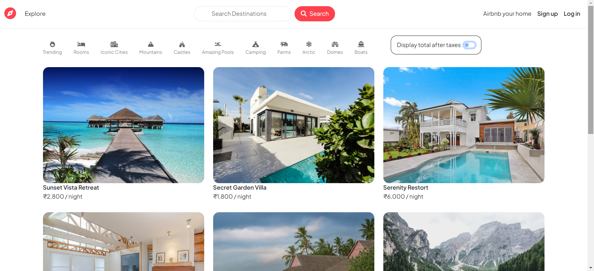

# WanderLust - Travel the World

## Project Overview
WanderLust is a full-stack web platform designed to facilitate travel experiences similar to Airbnb. It allows users to create profiles, list properties for travelers by uploading property images, prices, and locations, and helps travelers decide their next destination based on reviews and ratings.

## Features
- **User Profiles**: Users can create profiles to manage their listings and bookings.
- **Property Listings**: Hosts can upload property images, set prices, and specify locations.
- **Reviews and Ratings**: Travelers can leave reviews and ratings for properties.
- **Authentication and Authorization**: Implemented user authentication and authorization for secure access and data protection.

## Technologies Used
- **Frontend**: HTML, CSS, JavaScript
- **Backend**: Node.js, Express.js
- **Database**: MongoDB
- **Authentication**: JSON Web Tokens (JWT)
- **Middleware**: Express middleware for authentication, validation, and error management

## Screenshot

